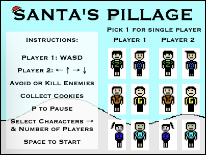
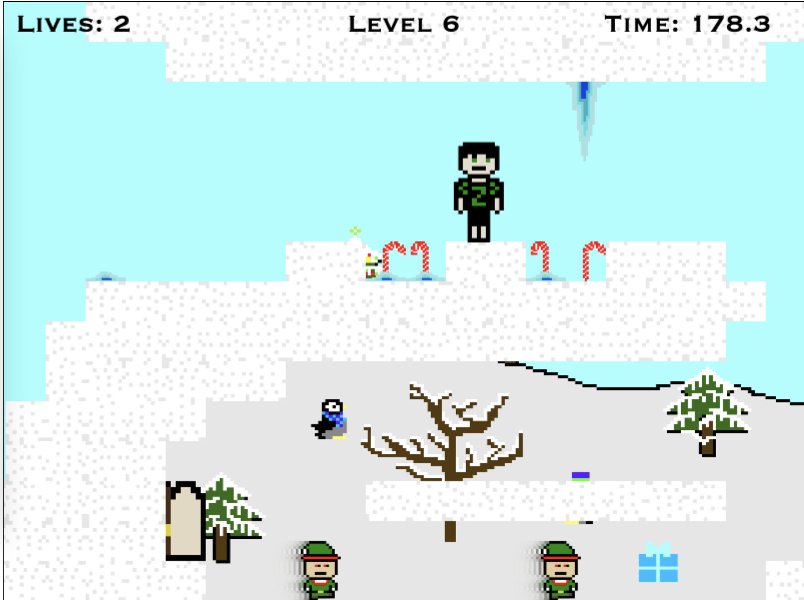
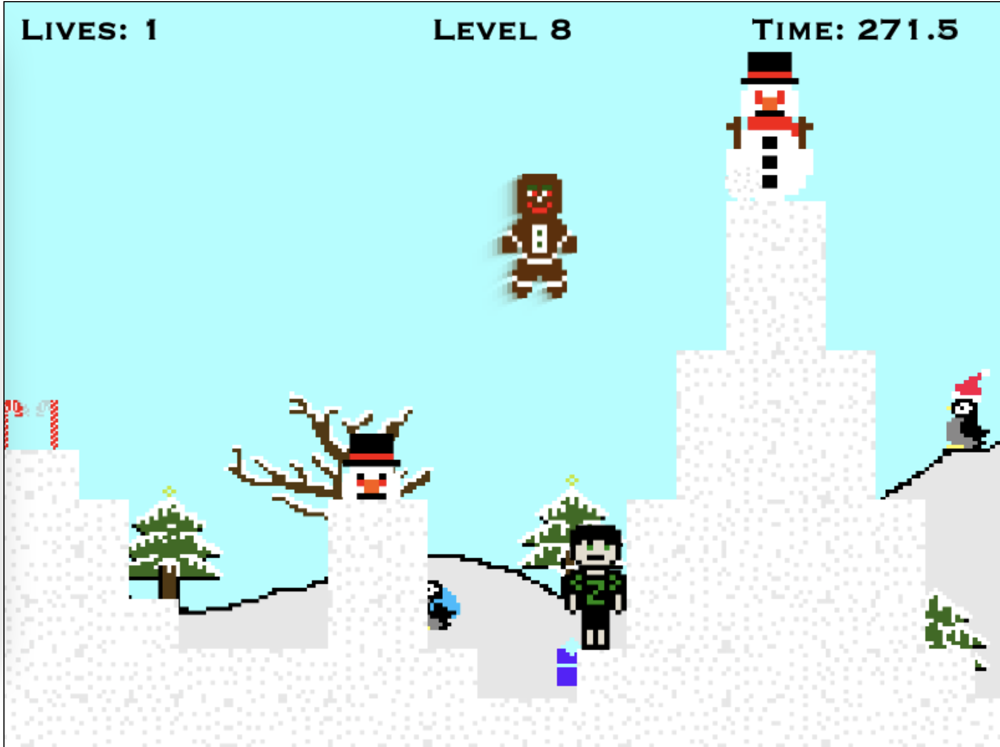
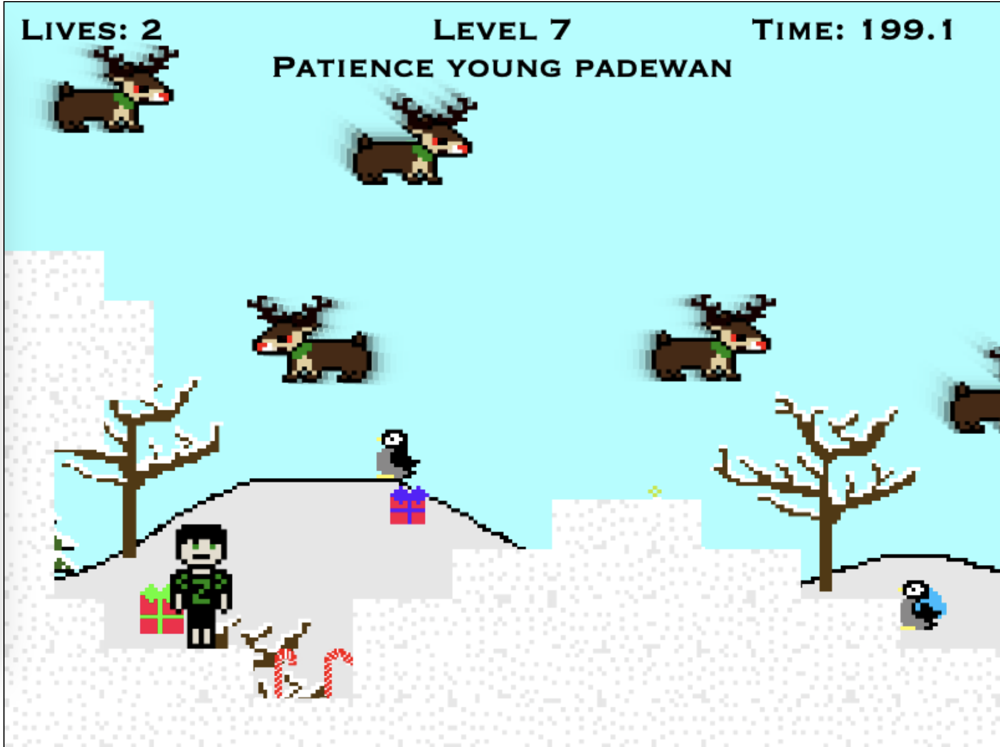
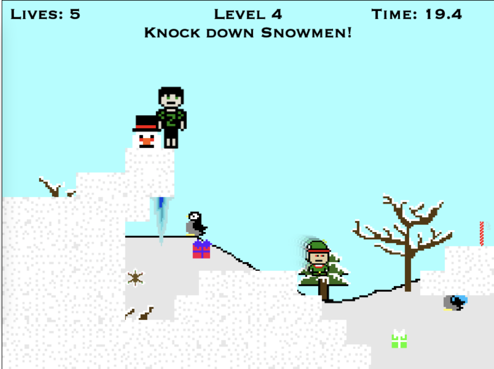
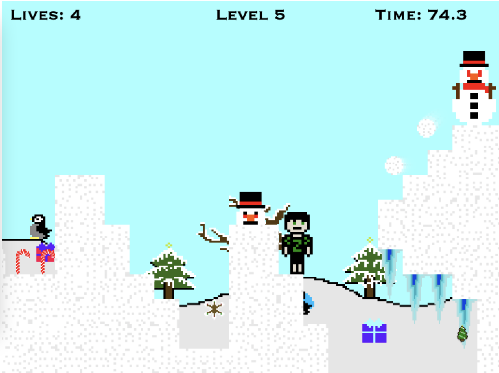

# 🎅🏻 Santa's Pillage ☠️: My first big video game! 
## Play the game 🕹[here](https://insomnizac.itch.io/santas-pillage)🎮

This game was created in vanilla javascript, no libraries, just canvas. I designed this game based off of another game I made during a game jam. 

The other game was called [Haunted House](https://insomnizac.itch.io/escape-the-haunted-house)🎃, and it had a lot of bugs that I knew how to fix, but didn't have time to during the game jam. (It did give me good pixel art for my github profile though.) 

I spent a few weeks coding the first 10% of the game, then on December 23rd realized I had 2 days to finish it, and coded the last 90% in those 48 hours. ⌨️

All of the pixel art 👾, music 🎼, design 🎨, and code 👨🏻‍💻 was written by me, with a small amount of code help from a padawan [Weiqi Xu](https://github.com/weiqixu05).

The music is definitely better than the code, but hopefully you still enjoy the game. 

<table>
	<tr>
		<td colspan="2">
			
		</td>
	</tr>
	<tr>
		<td>
			
		</td>
		<td>
			
		</td>
	</tr>
	<tr>
		<td>
			
		</td>
		<td>
			
		</td>
	</tr>
	<tr>
		<td>
			
		</td>
		<td>
			
		</td>
	</tr>
</table>

$5 if you beat it. 💸
